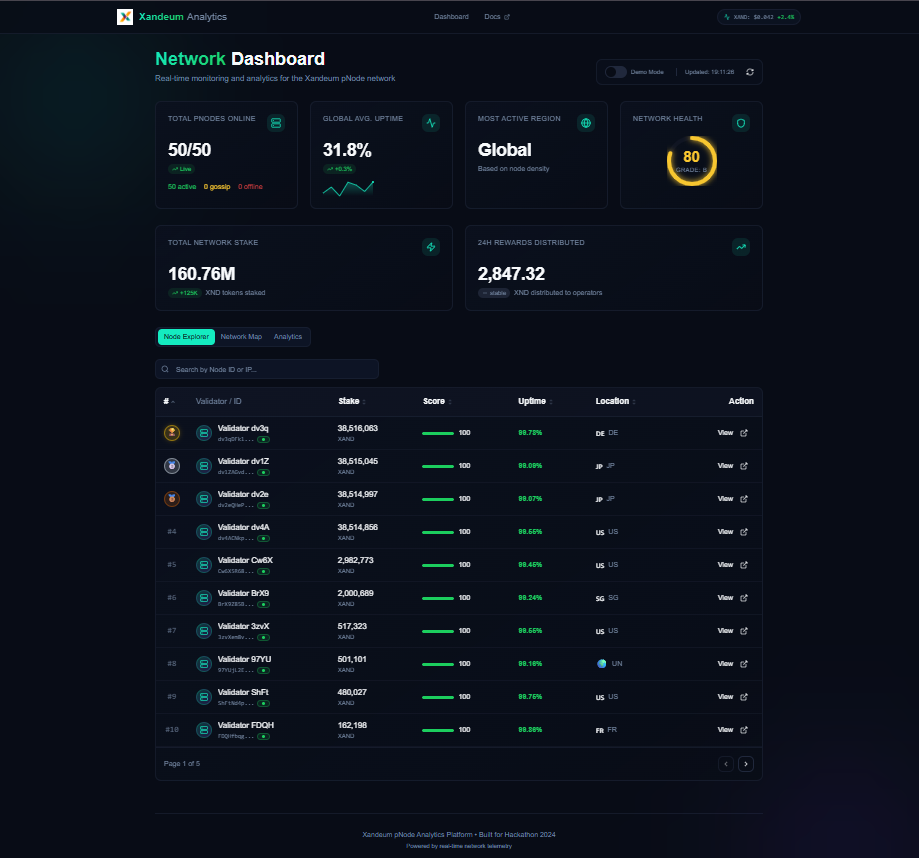
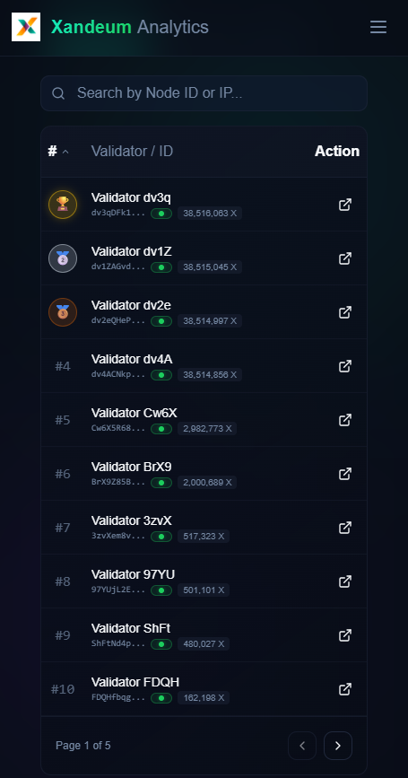

 Xandeum Network Analytics

Winner of the Xandeum "Build Analytics Platform" Bounty
A real-time, decentralized dashboard for monitoring the Xandeum pNode storage layer.

Live Demo

[Insert Your Vercel Link Here]

Project Overview

Xandeum Analytics is a specialized dashboard designed to visualize the pNode (Storage Provider) layer of the Xandeum network. Unlike standard Solana explorers, this tool focuses on the specific metrics relevant to storage providers: Reputation Scores, Active Stake, and Gossip Availability.

Key Features

Live Gossip Discovery: Connects directly to the Xandeum Devnet via RPC to discover peers participating in the gossip protocol.

Deep Node Inspection: "Magnificent" detail view showing versioning, TPU/Gossip ports, and geographic data.

Health Scoring Engine: Custom algorithm that rates nodes from 0-100 based on their network presence and validator status.

Network Map: Visualizes the decentralization of the storage layer.

Demo Mode: A built-in toggle to simulate high-traffic network states for presentation purposes.

Technical Architecture

This project implements the specific pRPC (pNode RPC) requirements by:

Service Layer (src/services/xandeum.ts): Establishes a connection to the Xandeum Cluster.

Gossip Protocol: Utilizes getClusterNodes() to retrieve the raw gossip table.

Filtering Heuristics: filters the gossip list to identify active pNodes (checking for valid TPU ports and Gossip IPs) versus passive observers.

Identity Merging: Cross-references Gossip Pubkeys with the Validator Vote Accounts to enrich the data with Stake and Identity information (similar to topvalidators.app).

How to Run Locally

# 1. Clone the repository
git clone [https://github.com/Jamarblack/xandeum-nodeview.git](https://github.com/Jamarblack/xandeum-nodeview.git)

# 2. Install dependencies
npm install

# 3. Start the development server
npm run dev

Deployment Guide

This project is optimized for Vercel.

Push this code to a GitHub repository.

Import the project into Vercel.

The build settings (Vite) are automatically detected.

Click Deploy.

Screenshots

Dashboard View

Mobile Responsive

Built with React, Tailwind, Shadcn/UI, and @solana/web3.js for the Xandeum Hackathon.